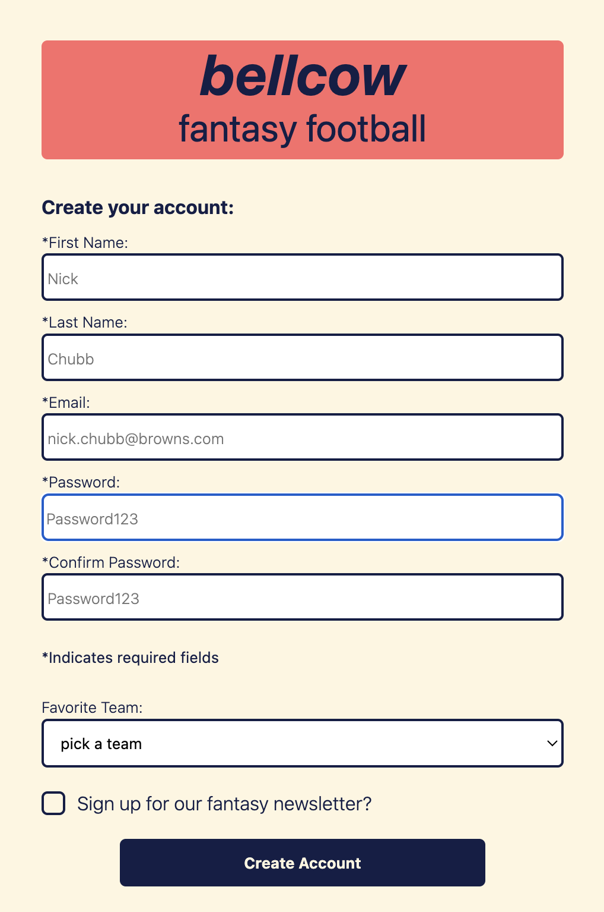

# signup-form

This is a solution to the [Sign-up Form assignment in The Odin Project](https://www.theodinproject.com/lessons/foundations-calculator).

## Table of contents

- [Overview](#overview)
  - [The challenge](#the-challenge)
  - [Screenshot](#screenshot)
  - [Links](#links)
- [My process](#my-process)
  - [Built with](#built-with)
  - [What I learned](#what-i-learned)
  - [Continued development](#continued-development)
  -[Acknowledgements](#acknowledgments)

## Overview

### The challenge

Create a sign-up form that accepts and validates inputs for text, email, passwords. The goal is to practice building and styling forms, with an focus on validation, accessibility, and design. 

### Screenshot

Here's the mobile view

### Links

- Solution URL: [solution](https://github.com/importvince/signup-form)
- Live Site URL: [live site](https://importvince.github.io/signup-form/)

## My process

### Built with

- Semantic HTML5 markup
- CSS Flex
- Javascript

### What I learned

1. How to style inputs in valid and invalid states
2. How to use regular expressions for email and password patterns
3. How to use javascript to check for password match
4. How to send to a thank you page on form submission
5. How to style checkboxes...tricky!

### Continued development

This was good practice getting back to HTML and CSS. After finishing foundations, a lot of my focus had been on Javascript. I then tried to learn Tailwind while I worked through this section, but found myself missing regular CSS so I stuck with that here. My goal from here on out is =to maintain a focus on quality CSS work because it can really be the most frustrating aspect of coding, but also the most enjoyable. 

## Acknowledgments

Thank you to fantasy football for the inspiration. Maybe this will become a real site someday...

